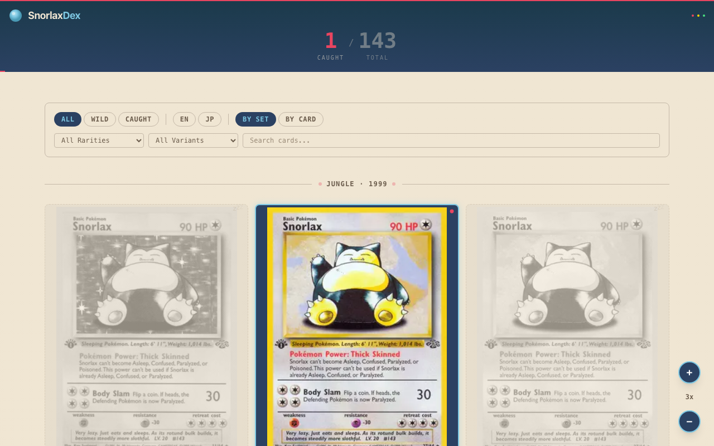

# SnorlaxDex

A Pokemon TCG collection tracker with a Pokedex-inspired interface. Browse every Snorlax card ever printed, filter by language, rarity, and variant, and mark the ones you own.



## Features

- **Full Snorlax catalog** — every Snorlax card across all TCG sets and languages, pulled from the Pokemon TCG API
- **Collection tracking** — toggle cards as "caught" with a single click, synced to a PostgreSQL database
- **Filters** — narrow by language, rarity, variant (V, VMAX, EX, etc.), and free-text search
- **Progress counter** — animated tracker showing caught vs. total cards
- **Card detail modal** — full card art with ownership toggle
- **Zoom controls** — adjust grid density to see more cards or bigger artwork
- **Set dividers** — cards grouped by their original TCG set

## Tech stack

- **Next.js 16** / React 19 / TypeScript
- **Tailwind CSS** for styling
- **Framer Motion** for animations
- **Drizzle ORM** + PostgreSQL for persistence
- **Pokemon TCG SDK** for card data
- **Vitest** for tests

## Run locally

```bash
git clone https://github.com/L-ubu/snorlax-dex.git
cd snorlax-dex
npm install
npm run dev
```

Requires a PostgreSQL database. Set `DATABASE_URL` in `.env.local`.

## License

MIT
